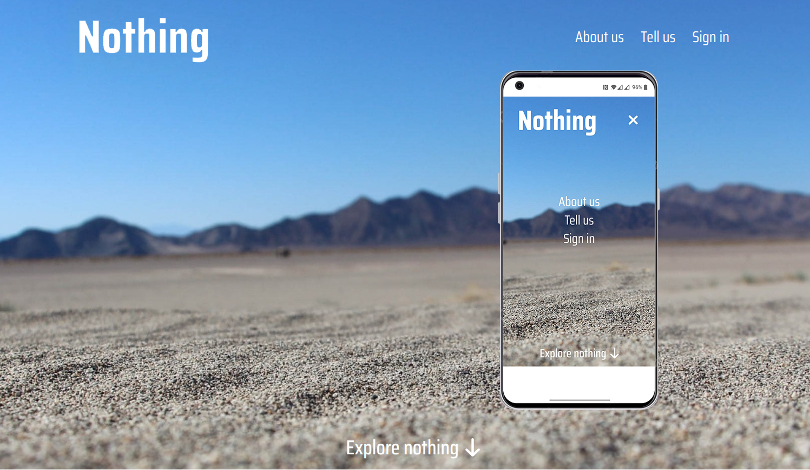
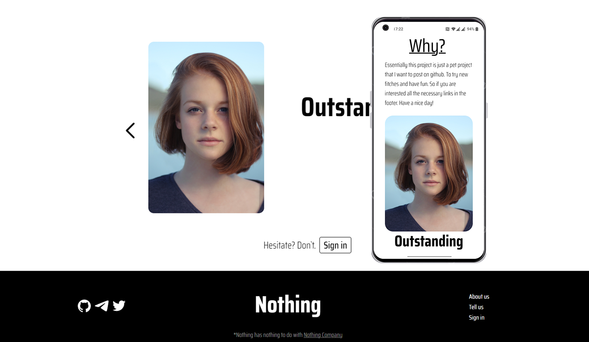
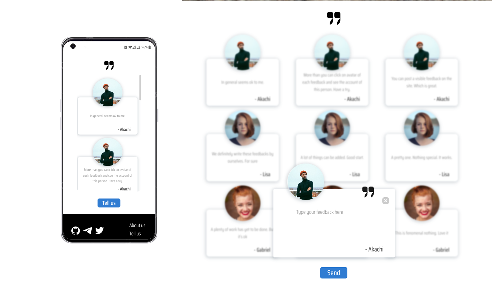
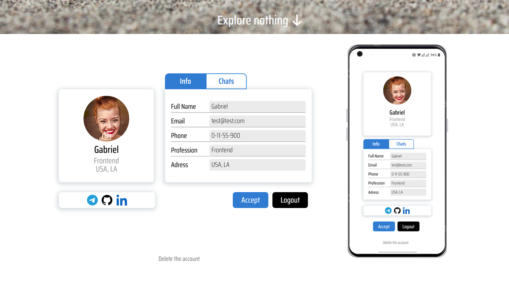
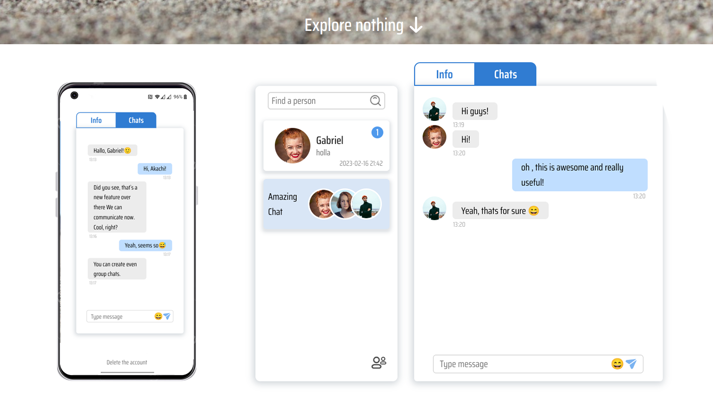
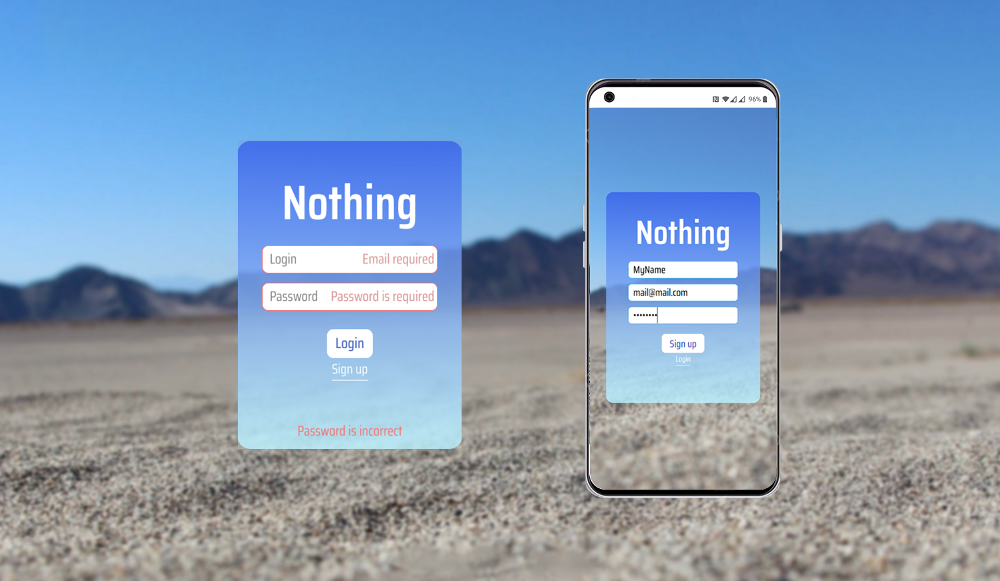
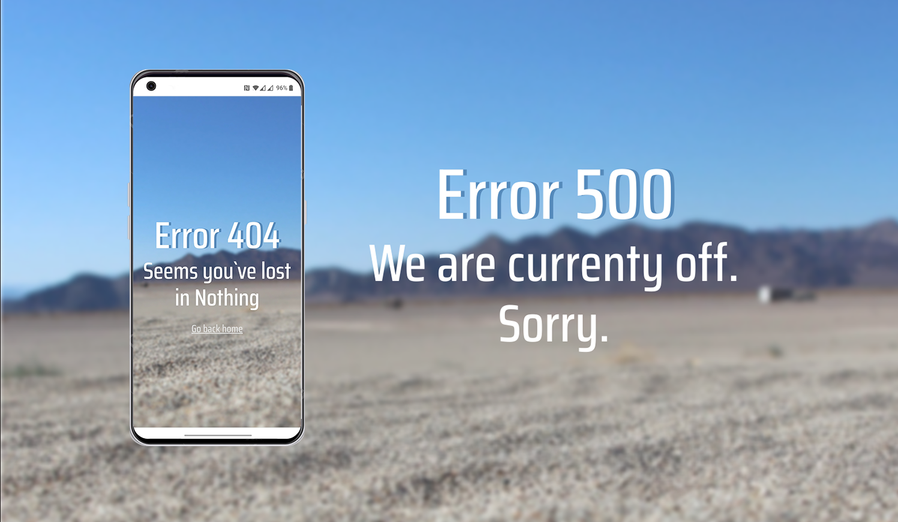

## Would be very grateful for you star. Thank you ^^
### Ok, lest get familiar with the project

1. First. We have main page with logo and menu.

2. Then body and footer with feedbacks and contacts.

3. Let's see "tell us". It's just a page, where you can post your message about site. Or whatever else.

4. Account. You can change your profile picture and add info about yourself.

5. Chat. You can find people and communicate with them. Available both personal and group chats.

6. Login page.

7. My favorites - error pages.

### 1. server : fill the env-exmaple, **npm run prep**. To run server - **npm start**; 
### 2. client : **npm install, npm start**

